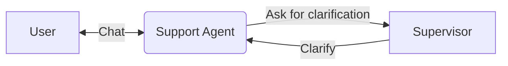

## Overview
We have a user, talking to our agent. The agent can answer questions, do tasks and play along. It can also ask the supervisor for clarifications if needed.



## Primitives
```python 
from chetan import ChetanManager
 
# Initialize a manager object
mgr = ChetanManager()

# Manager starts to track any chetan object created on the go
mgr.bind()
```

### Language Model
```python
from chetan.llm import OpenAILLM
 
llm = OpenAILLM()
mgr.models["default"] = llm
```

### Agent architecture
#### Modules
```python
from chetan.modules.rec import ToolRecommender
from chetan.modules.memory import SimpleKVMemory
 
# Embedding-based recommender to suggest relevant tools
tool_rec = ToolRecommender()
# based on the current context and user input
kv_mem = SimpleKVMemory(k=4)
```

#### Agent Loop
```python
from chetan.agent import AgentLoop
 
agentloop = AgentLoop().use(
  tool_rec,
  kv_mem
)
mgr.agentloops["default"] = agentloop
```

##### Process function
```python
@agentloop.process
def process_function(ctx):
    # Generate a textual response, as well as tool call
    # Optimized for models like Claude 3.7 Sonnet
    # If model doesn't support both at once, they will be prompted sequentially
    # Otherwise failed
    ctx.generate_with_tool_call()
```

### Tools
```python
from chetan.tools import ToolBox, Tool
 
from chetan.tools.integrations import TavilyWebSearch
from chetan.tools import MCP
 
tavily_search = Tool("tavily", "A web searcher tool", TavilyWebSearch())
 
kb_search = Tool(
    "kb_search",
    "Search for information on the provided knowledgebase",
    MCP("<path-to-your-knowledgebase-mcp>"),
)
```

#### Toolbox
```python
# Include the standard toolset with essential communication tools.
from chetan.tools.standard import StandardToolset
 
toolbox = ToolBox(
    {
        "web": {tavily_search}, 
        "knowledge": {kg_search}
    },
    StandardToolSet
)
mgr.toolbox = toolbox
```

### Finalize setup
This will allow modules to setup resources like vector databases, indexes.

```python

```

## Entity

### Agents

```python
from chetan import parse_agents

agents = parse_agents({
    "support-agent": {
        "role": "Support Agent",
        "descripion": "An agent to provide support the customers regarding their queries",
        "background": "You are a customer support agent. Your sole job is to assist the customers with their queries. For any clarifications, you can contact the supervisor. He will provide you with necessary information as soon as possible."
    }
})
mgr.agents = agents
```

### Users
```python
users = parse_users({
    "customer": {
        "description": "The customer requiring assistance"
    },
    "supervisor": {
        "description": ""
    }
})

mgr.users = users
```

## System

### Protocol schemas
### Topology

## Orchestration