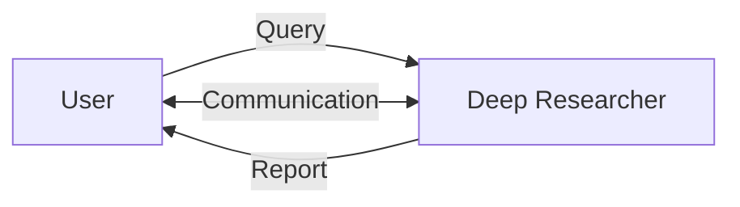

import { Tab, Tabs } from "fumadocs-ui/components/tabs";

## Overview
Deep research is a trending agent that collects data from hundreds of sources and analyzes them to provide a report.

We will employ a single-agent system to conduct deep research.



## Primitives

We first initiate a manager instance.

```python
from chetan import ChetanManager

# Initialize a manager object
mgr = ChetanManager()
```

### Language Model

```python
from chetan.llm import OpenAILLM

# Set the default LLM
mgr.llm.default = OpenAILLM()
```

### Agent Architecture
#### Modules
```python
from chetan.modules.rec import ToolRecommender

# Advanced recommender to suggest relevant tools to agent
tool_rec = ToolRecommender()
# based on the current context and user input
kv_mem = SimpleKVMemory(k=4)
```
#### Agent Loop
```python
from chetan.agent import AgentLoop

# Sequentially use the agent modules
mgr.agent_loops.default = AgentLoop().use(
  tool_rec,
  kv_mem
)
```

### Tools

We will use the following tools:
    - Tavily Web Search

```python
from chetan.tools import Tool

from chetan.tools.integrations import TavilyWebSearch

tavily_search = Tool(
    "tavily", "A web searcher tool", TavilyWebSearch()
)
```
#### Toolbox
```python
from chetan.tools import ToolBox

# Include the standard toolset with essential communication tools.
from chetan.tools.standard import StandardToolset

mgr.toolbox = ToolBox({"web": {tavily_search}}, StandardToolset)

```

## Entities
### Agents
We will parse agents from a JSON object.
```python
# Parse agents
mgr.parse_agents({
    "researcher": {
        "role": "Deep Researcher",
        "description": "An advanced research agent that gathers, analyzes, and synthesizes information from multiple sources to provide comprehensive insights and reports on complex topics.",
        "background": "I was designed to conduct thorough research by searching across various databases, academic papers, news sources, and web content. I excel at identifying reliable information, cross-referencing facts, and compiling structured reports that highlight key findings and their implications.",
    },
})
```
### Users
```python
# Set the default user
mgr.user.default = default_user()
```
## System

### Protocol schemas
```python
from pydantic import BaseModel
from typing import List

class Links(BaseModel):
    links: List[str]
```

### Topology
We will use the `Network` topolgy here.

```python
mgr.system.default = mgr.create_network(
    """
    user <--> researcher
    researcher --[links]--> user
    """,
    structured_protocols={
        "links": {
            "description": "Support your report providing links to the user",
            "format": Links,
        },
    }
)
```
## Orchestrate
```python
from chetan.orchestra import BaseOrchestrator

# We can simply use the base orchestrator, since no specialized command is needed
mgr.orchestrators.default = BaseOrchestrator
```

## Serving
### Terminal
```python
from chetan.inference.terminal import TerminalInference

mgr.orchestrators.default.infer(
    TerminalInference(
        role="user", # or role="global"
    )
)
```

### Network
```python
from zerve import Zerve

mgr.orchestrators.default.infer(
    Zerve() 
    .serve(
        "http",
        port=8080,
        host="0.0.0.0",
        log_level="info",
    )
)
```

Now we can connect to the hosted `Zerve` orchestrator from `Chetanbase`.