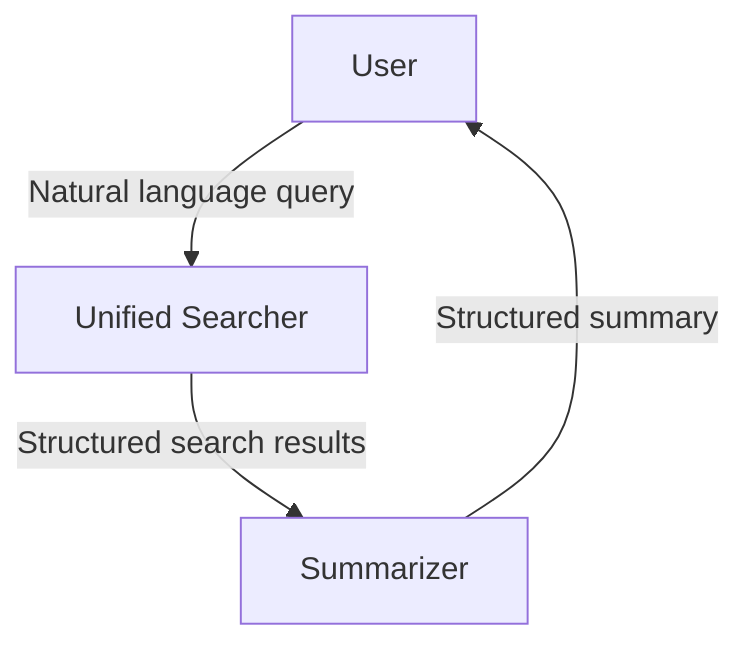

import { Tab, Tabs } from "fumadocs-ui/components/tabs";

## Overview

In this example, a user searches for information with a query. The unified searcher searches accross sources and sends it to the summarizer, which condenses the information and sends it back to the user.



## Primitives

We first initiate a manager instance.

```python
from chetan import ChetanManager

# Initialize a manager object
mgr = ChetanManager()
```

### Language Model

```python
from chetan.llm import OpenAILLM

mgr.llm.default = OpenAILLM()  # Automatically used, can be omitted
```

### Agent Architecture
#### Modules
```python
from chetan.modules.rec import ToolRecommender
from chetan.modules.memory import SimpleKVMemory

# Embedding-based recommender to suggest relevant tools
tool_rec = ToolRecommender()
# based on the current context and user input
kv_mem = SimpleKVMemory(k=4)
```
#### Agent Loop
```python
from chetan.agent import AgentLoop

# Sequentially use the agent modules
mgr.agent_loops.default = AgentLoop().use(
  tool_rec,
  kv_mem
)
```

### Tools

We will use the following tools:
    - Tavily Web Search
    - Postgres SQL Executor
    - Knowledge-base Search

```python
from chetan.tools import ToolBox, Tool

from chetan.tools.integrations import TavilyWebSearch
from chetan.tools import MCP

tavily_search = Tool("tavily", "A web searcher tool", TavilyWebSearch())

postgresql_exec = Tool(
    "postgresql",
    "Execute SQL commands in the designated Postgres Server. Read only access.",
    MCP("<path-to-your-postgres-mcp>"),
)

kb_search = Tool(
    "kb_search",
    "Search for information on the provided knowledgebase",
    MCP("<path-to-your-knowledgebase-mcp>"),
)
```

#### Toolbox
```python
# Include the standard toolset with essential communication tools.
from chetan.tools.standard import StandardToolset

mgr.toolbox = ToolBox(
    {"web": {tavily_search}, "db": {postgresql_exec}, "knowledge": {kg_search}},
    StandardToolSet
)
```

## Entities
### Agents
We will parse agents from a JSON object.
```python
# Parse agents
mgr.parse_agents({
    "searcher": {
        "role": "Source Searcher",
        "description": "A searcher using multiple sources like search engines, databases, docs, etc.",
        "background": "You are a searcher. You find information on various sources, combine them.",
    },
    "summarizer": {
        "role": "Summarizer",
        "description": "A summarizer that condenses information.",
        "background": "You are a summarizer. You condense search information.",
    },
})
```
### Users
We will define every user who will be on this system.

By default, a single user will be registered upon manager creation. So this code would be redundant, but that's what happens under the hood.
```python
# Set the default user
mgr.user.default = default_user()
```
## System

### Protocol schemas

In order to maintain a structured communication between the agents, we define structured protocol schemas. These schemas are used to validate the data being sent and received between the agents.

```python
from pydantic import BaseModel

class SearchResult(BaseModel):
    title: str
    url: str
    snippet: str
    source: Literal["web", "doc", "db"]

class SearchResults(BaseModel):
    results: List[SearchResult]

class Summary(BaseModel):
    content: str
    references: List[SearchResult]
```

### Topology
We show two approaches here; `Ring` or `Network`

<Tabs items={["Ring", "Network"]} defaultValue="Ring">
<Tab value="Ring">

```python
mgr.system.default = mgr.create_ring(
    "user",
    "searcher",
    {
        "description": "Sending search results to the summarizer",
        "format": SearchResults,
        "prechecks": []
    },
    "summarizer",
    {
        "description": "Sending summary to the user",
        "format": Summary,
    }
)
```
</Tab>

<Tab value="Network">

```python
mgr.system.default = mgr.create_network(
    "user --> searcher --[results]--> summarizer --[summary]--> user",
    structured_protocols={
        "results": {
            "description": "Sending search results to the summarizer",
            "format": SearchResults,
        },
        "summary": {
            "description": "Sending summary to the user",
            "format": Summary,
        }
    }
)
```
</Tab>
</Tabs>

## Orchestrate
```python
from chetan.orchestra import BaseOrchestrator, command

class SearcherOrchestrator(BaseOrchestrator):

    @command
    async def search(self, query: str) -> List[SearchResult]:
        """
        Search for information with a given query.

        Args:
            query (str): The query to search for.
        Returns:
            List[SearchResult]: The search results.
        """

        def summarizer_message_received():
            return len(self.protocols["summary"]) > 0

        with (
            await self.message(
                "user", "searcher", query
            )  # Send the query, from user, to the searcher
            .propagate(
                max={
                    "time": 60,  # 1 minute
                    "agent_iter": 10,  # 10 iterations for each agent
                }
            )
        ) as work:
            pass


# Do not instantiate the orchestrator
mgr.orchestrators.default = SearcherOrchestrator
```

## Serving
### Terminal
```python
from chetan.inference.terminal import TerminalInference

mgr.orchestrators.default.infer(
    TerminalInference(
        role="user", # or role="global"
    )
)
```

### Network
```python
from zerve import Zerve

mgr.orchestrators.default.infer(
    Zerve() 
    .serve(
        "http",
        port=8080,
        host="0.0.0.0",
        log_level="info",
    )
)
```

Now we can connect to the hosted `Zerve` orchestrator from `Chetanbase`.