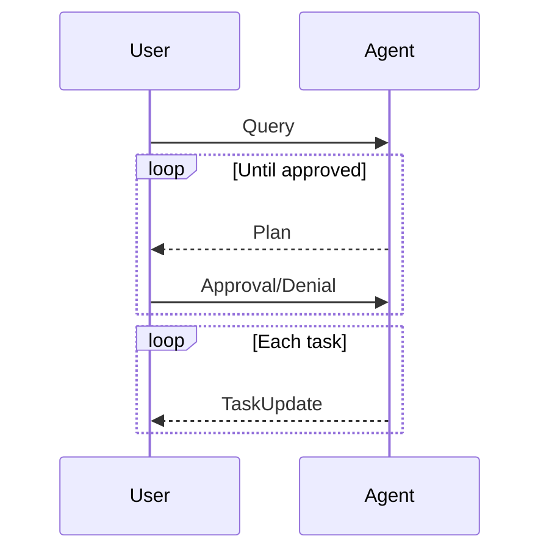

import { Tab, Tabs } from "fumadocs-ui/components/tabs";

## Overview
We will create a simple task executor agent with planning.



## Primitives

We first initiate a manager instance.

```python
from chetan import ChetanManager

# Initialize a manager object
mgr = ChetanManager()
```

### Language Model

```python
from chetan.llm import LMOpenAI

# Set the default LM
mgr.lm.default = LMOpenAI()
```

### Agent Architecture
#### Modules
```python
from chetan.modules.rec import ToolRecommender

# Advanced recommender to suggest relevant tools to agent
tool_rec = ToolRecommender()
```
#### Agent Loop
```python
from chetan.agent import AgentLoop

# Sequentially use the agent modules
mgr.agent_loops.default = AgentLoop().use(
  tool_rec
)
```

### Tools

We will use the following tools:
    - Tavily Web Search

```python
from chetan.tools import Tool

from chetan.tools.integrations import TavilyWebSearch

tavily_search = Tool(
    "A web searcher tool", 
    TavilyWebSearch(), 
    # We will gate this tool to be only invokable if a plan is approved
    tags=["require_approval"]
)
```
#### Toolbox
```python
from chetan.tools import ToolBox

# Include the standard toolset with essential communication tools.
from chetan.tools.standard import StandardToolset

mgr.toolbox = ToolBox({"web": {"tavily": tavily_search}}, standard_toolset)
```

## Entities
### Agents
We will parse agents from a JSON object.
```python
# Parse agents
mgr.parse_agents({
    "planned_executor": {
        "role": "Planner & Executor",
        "description": "Based on a given user query, converse and negotiate a plan with the user, then sequentially finish each task, providing success/error metrics to the user.",
        "background": "A highly skilled agent with a strong background in planning and execution.",
    },
})
```
### Users
```python
# Set the default user
mgr.user.default = default_user()
```
## System

### Protocol schemas
```python
from pydantic import BaseModel
from typing import List

class Task(BaseModel):
    id: str
    title: str
    description: str
    tools: List[str]

class Plan(BaseModel):
    steps: List[Task]

class TaskUpdate(BaseModel):
    task_id: str
    success: bool

class PlanDecision(BaseModel):
    accepted: bool
    reason: str
```

```python
from chetan.system import StructuredProtocol

plan_protocol = StructuredProtocol(
    "plan",
    "Agent provides a plan to the user.",
    Plan
)

decision_protocol = StructuredProtocol(
    "decision",
    "Whether the plan was approved by the user or not.",
    PlanDecision
)

update_protocol = StructuredProtocol(
    "update",
    "Agent reports success/error of each task in detail to the user",
    TaskUpdate
)
```

```python
@decision_protocol.precheck
def has_plan_arrived(state):
    if len(state.protocols["plan"].items) > 0:
        return True
    else:
        raise Error("Can't make a decision. Plan hasn't arrived.")


@update_protocol.precheck
def is_approved(state):
    target = state.protocols["decision"]
    if len(target.items) == 0:
        raise Error("No decision is provided")
    if not target.items[-1].value.accepted:
        raise Error("Plan was not accepted")
    return True

```

### Topology
We will use the `Network` topolgy here.

```python
mgr.system.default = mgr.create_network(
    """
    user <--> planned_executor
    user --[decision]--> planned_executor
    planned_executor --[plan,update]--> user
    """,
    structured_protocols=[
        plan_protocol,
        decision_protocol,
        update_protocol
    ]
)
```
## Orchestrate
```python
from chetan.orchestra import BaseOrchestrator


class SimplePlannedExecutorOrchestrator(BaseOrchestrator):

    def is_plan_approved(self):
        target = self.state.protocols["decision"]

        if len(target.items) == 0:
            raise Error("No decision is provided")

        if not target.items[-1].value.accepted:
            raise Error("Plan was not accepted")

        return True

    def on_tool_call(self, tool_calls):
        approved = self.is_plan_approved()

        for call in tool_calls:
            if "require_approval" in call.target.tags:
                return approved

        return True


# Do not instantiate the orchestrator
mgr.orchestrators.default = BaseOrchestrator

```

## Serving
### Terminal
```python
from chetan.inference.terminal import TerminalInference

mgr.orchestrators.default.infer(
    TerminalInference(
        role="user", # or role="global"
    )
)
```

### Network
```python
from zerve import Zerve

mgr.orchestrators.default.infer(
    Zerve() 
    .serve(
        "http",
        port=8080,
        host="0.0.0.0",
        log_level="info",
    )
)
```

Now we can connect to the hosted `Zerve` orchestrator from `Chetanbase`.
