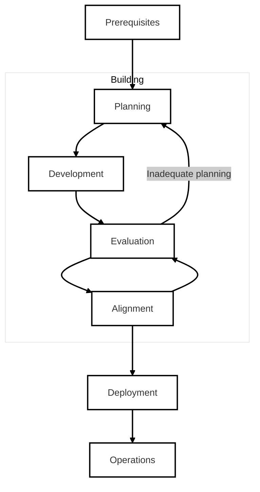

**Agent Operations** (abbreviated *AgentOps*) is the practice of building, deploying, and maintaining agent systems. It encompasses the entire lifecycle of an agent system, from development to deployment and monitoring.

To maintain an **aligned**, **performant** and **efficient** agent system, we must carefully  each stage of the lifecycle, and evaluate every decision. This includes:
- **Development**: Building the agent system, including selecting the right models, tools, and frameworks.
- **Deployment**: Deploying the agent system to a production environment, including scaling and optimizing for performance.
- **Monitoring**: Monitoring the agent system in production, including tracking performance, usage, and other metrics.

