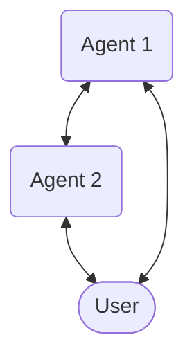

import defaultMdxComponents from 'fumadocs-ui/mdx';

There are two possible paradigm available.
## Paradigms
### Fully tool-called
Agents use **tool-calling** with *communication tools* to communicate with other agents or users.

### Full without user
<Callout type="warn">
This paradigm only works in single users,
</Callout>

## Comparison

| Feature | Fully tool-called | Full without user |
|---|---|---|
|Multi-user|✅| Not targetable. All receive when targeted. |
|Multi-agent|✅|✅|
