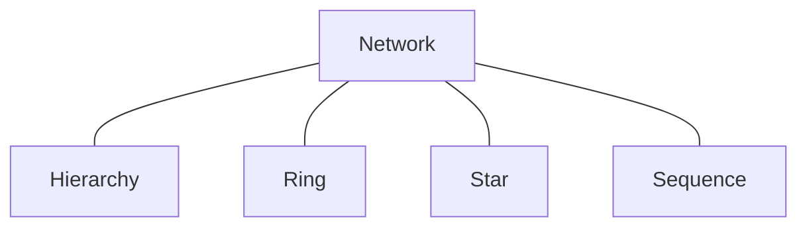

Topologies are the formation of the system. They define how the system is structured and how the components interact with each other. The topology can have a significant impact on the performance, scalability, and maintainability of the system.

## Types
<Cards>
<Card title='Network' href='/docs/framework/system/topologies/network' />
<Card title='Hierarchy' href='/docs/framework/system/topologies/hierarchy' />

<Card title='Ring' href='/docs/framework/system/topologies/ring' />
<Card title='Star' href='/docs/framework/system/topologies/star' />
<Card title='Sequence' href='/docs/framework/system/topologies/sequence' />
</Cards>

## Lineage
Every topology is based on the network topology.
